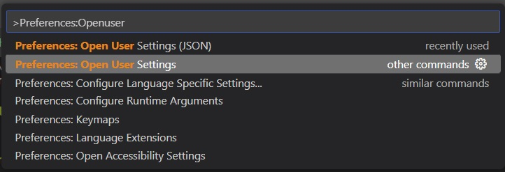
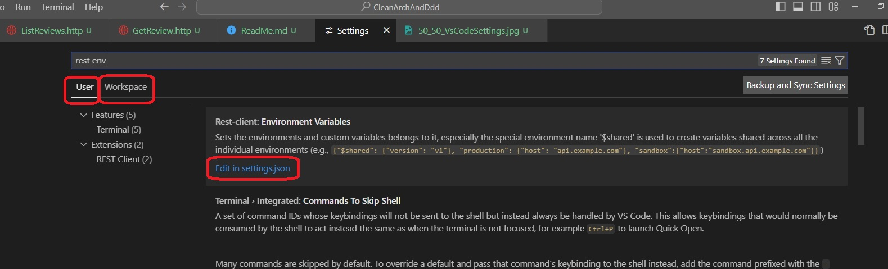
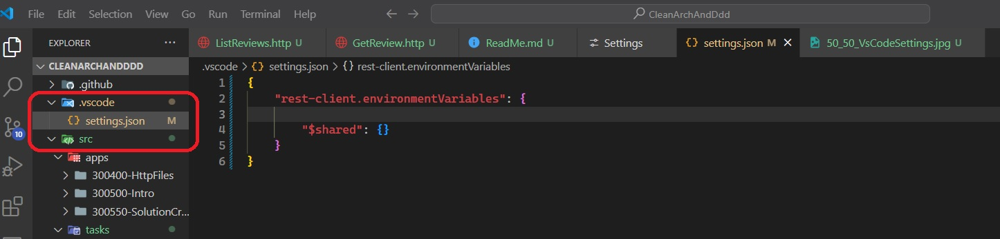
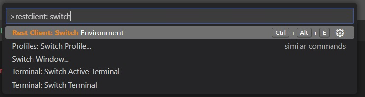
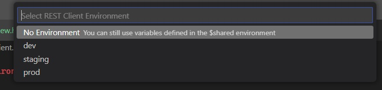
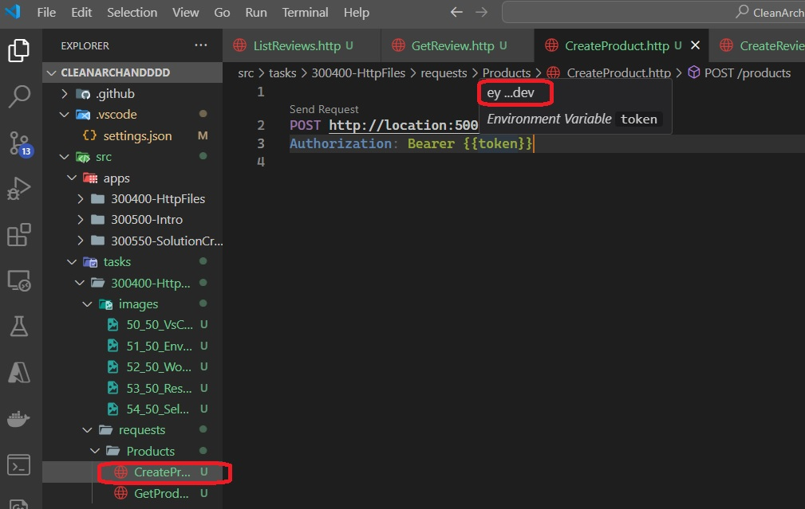

The Best Way To Send HTTP Requests
https://www.youtube.com/watch?v=Ounk4W_ttiE

http file is a file with extension http, so foo.http

1. Local varible, or file varibles.
@token are 

2. For global or environment varibles, do the following.

Ctrl + Shift + P and select Preferences: Open User Settings.



Select Workspace settings and then click on edit in settings.json



Now as the settings.json file is created for you and start editing it



Add different environments as follows. 

```json
{
    "rest-client.environmentVariables": {

        "$shared": {},
        "dev": {
            "token": "ey ..."
        },
        "staging": {
            "token": "ey ..."
        },
        "prod": {
            "token": "ey ..."
        },
    }
}
```

Next open command platte(Ctrl + Shift + P) and then select rest client switch env as follows.




Now you will see the following. Select the environment.



Now in your http file, if you hover over any variable, you can see the value of the variable as follows.




